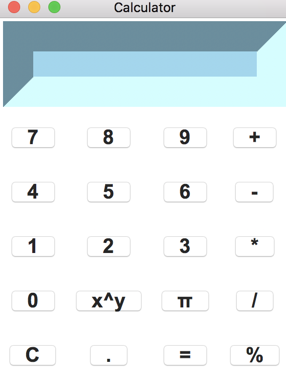

# GUI calculator
Basic GUI calculator in OOP style written in python with Tkinter library.

## Run gui calculator
Run script from the root directory of the project:
```bash
~ python calc.py
```

## Demo


## Contributing

- clone the repository
- configure Git for the first time after cloning with your name and email
  ```bash
  git config --local user.name "Volodymyr Yahello"
  git config --local user.email "vyahello@gmail.com"
  ```
- `python 3+` is required to run the code
- run `pip install -r requirements.txt` to install all required python packages
